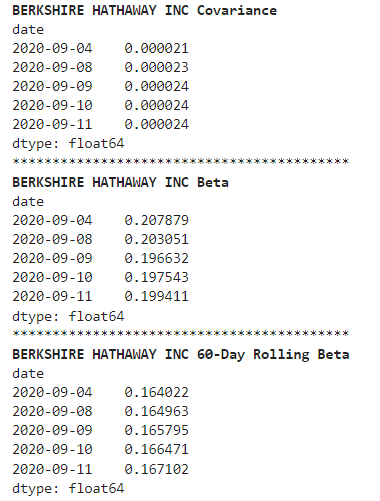
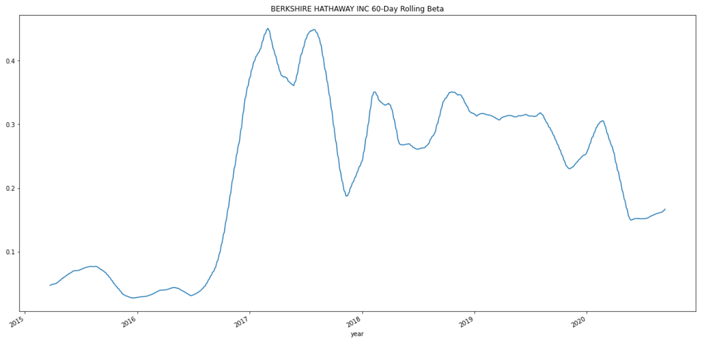

# Project Title:  Investment Evaluation

THe Investment Analysis application is a python comment-line interface program.  It collects, prepares, and analyzes the investment portfolio data to determine the fund with the most investment potential based on key risk-management metrics: the daily returns, standard deviations, Sharpe ratios, and betas.

The application imports investment porfolio data from csv, prepares the data, and produces analysis on (i) Return, (ii) Risk & Return, (iii) Diversification, (iv) visualization of analysis.  The user can anlyze the application output data and charts and make recommendation on new investment options for inclusion in the client portfolios.

---

## Technologies

This project leverages python 3.7 with the following packages:

* [Jupyter Notebook](https://jupyter-notebook-beginner-guide.readthedocs.io/en/latest/what_is_jupyter.html) - It's a server-client application that allows editing and running notebook documents via a web browser.

* [sys](https://docs.python.org/3/library/sys.html) - For exit the program function exist.

* [csv](https://docs.python.org/3/library/csv.html) - For import csv file import and export

* [pathlib](https://docs.python.org/3/library/pathlib.html) -For object-oriented filesystem paths 

* [%matplotlib inline](https://pythonguides.com/what-is-matplotlib-inline/#:~:text=What%20is%20matplotlib%20inline%20in%20python%20IPython%20provides,two%20types%20of%20magic%20functions%2C%20line-oriented%20and%20cell-oriented.) - For Cell-oriented magic functions

* [pandas](https://pandas.pydata.org/pandas-docs/stable/index.html) - For Series, DataFrame, and plots

---

## Installation Guide

Before running the application first install the following dependencies.

```python
  pip install pandas
  pip install jupyterlab
```

---

## Usage

To use the Investment Analysis app, simply clone the `Investment Analysis' from the respository, open jupyter lab and open **risk_return_analysis.ipynb** with:

```python
jupyter lab
```
Upon launching the risk_return_analysis in jupyter notebook, you will have cell to input the source of portfolio data csv and then re-run the jupyter book to produce financial ratio and plots for the fortfolio data.

Enter the csv file path


Rerun the jupyterbook to receive data anlysis output


Below is financial ratio output example.



Below is financial chart output example.

---

## Contributors

Brought to you by FinTech Material and Eunice

---

## License

MIT